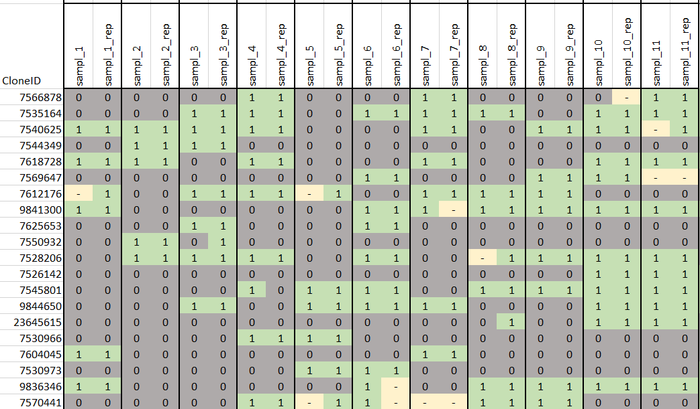
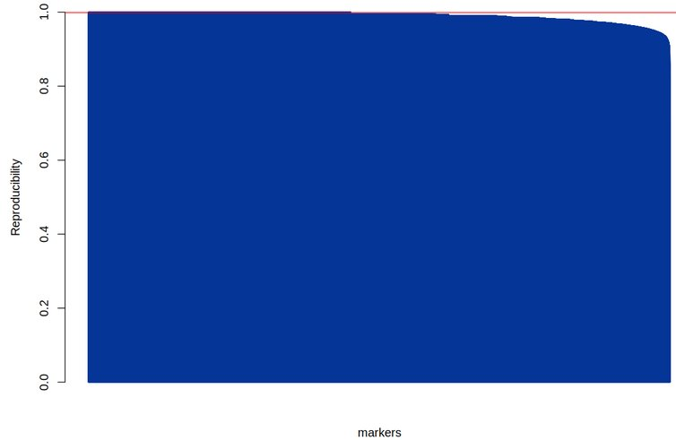
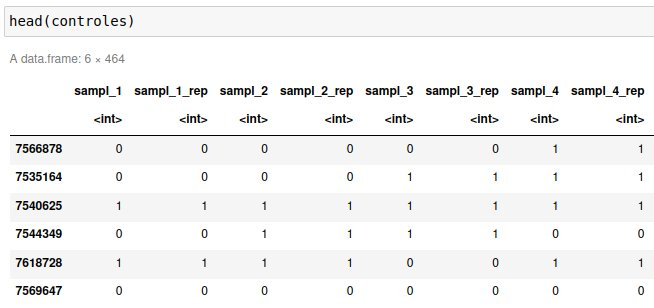
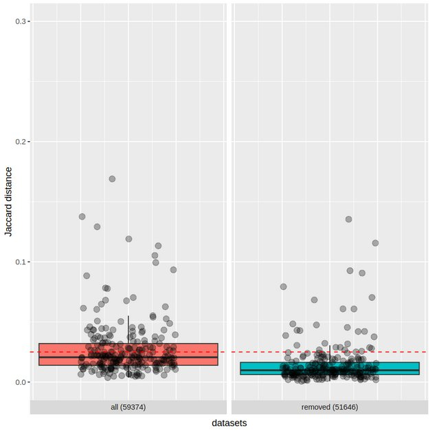
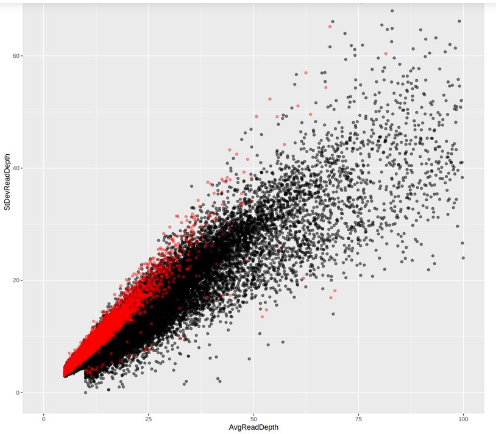

# Assessing redundancy in the CIP's sweetpotato germplasm collection using DArTSeq markers


&nbsp;

## 1.	Materials and methods
### 1.1.	Plant material and DNA Extraction.
As part of the molecular characterization efforts of sweet potato germplasm, biological and technical replicates were included in the regular DNA shipments to assess the reproducibility of markers and establish a threshold for distinguishing between unique and redundant genotypes. In this way, two hundred and twenty-four accessions were sent with replicates along the many DNA shipments required to characterize the total 5909 sweetpotato accessions. DNA was extracted using the CTAB method according to Doyle and Doyle (1990) with modifications.

### 1.2.	DArTSeq markers.
DArTSeq marker technology produce two type of markers, DArTSeq-derived SNPs and SilicoDArT (presence-absence) markers. The characterization of the 224 pairs of replicates produced 53,469 DArTSeq-derived SNPs and 59,374 SilicoDArT markers that were used to calculate a “reproducibility index” for each locus in the two types of markers.


Fig 1. Section of the SilicoDArT genotype matrix (59,374 SilicoDArT markers x 224 pair of samples).

&nbsp;

## 2.	Analysis with SilicoDArT markers
### 2.1.	Reproducibility index
Discrepancies or consistencies in the comparisons of the genotypes in each of the 224 replicate pairs were assessed for each marker. Discrepancies arise when different genotypes (1-0 or 0-1) occur in a pair of replicate samples, whereas in a successful and consistent comparison, the observed genotypes appears as 0-0 or 1-1. (see Fig1).
Our Reproducibility index is calculated by each marker as the percentage of pairs with successful and consistent comparisons, we only consider those pairs of replicates in which no missing data appear. This ratio of consistencies/observed pairs goes from 0 to 1. After the calculations for the 59,374 SilicoDArT markers, 7728 markers (13%) were identified as “low-reproducible” due to having a reproducibility index lower than 0.975. The remaining 51646 (87%) markers will be used for subsequent analyses.


Fig 3. Reproducibility index.

&nbsp;  
To verify if any correlation or patterns exist in these low-reproducible markers, based on their marker metrics (CallRate, OneRatio, PIC, AvgReadDepth and StDevReadDepth), we produce several plots of the metrics highlighting the low-reproducible markers. The most remarkable of them was the plot of the Average Read Depth versus its standard deviation. Here, the low-reproducible markers grouped in a specific region of the plot, indicating that these markers exhibit low sequencing depth levels and, additionally, a high variation of these low values among samples (Fig. 2).


### 2.2.	Estimation of threshold distance of redundancy 
After removing low-reproducible markers, to discard technical variation, Jaccard distances were calculated for all the 242 pairs of replicated samples. The distance value at the 95-percentile (0.025 of distance) was used as threshold value for subsequent analysis of redundancy. In our analysis, the replicate pairs with distance values above that threshold (above 0.025) can be explained by additional variation attributable to the sample (i.e. differences in the purity of the DNA between pairs) being that these replicate samples were extracted on different occasions, in the same way and conditions in which large numbers of samples are processed.
To verify the effect of the low-reproducible markers in the estimation of Jaccard distances (specifically between replicate pairs), two separate calculations were conducted using the complete set of 59,374 markers and another using 51,646 markers obtained after removal of low-reproducible markers (Fig. 3). After this, a noticeable decrease in distances is observed for the removed set.

### 2.3.	Duplicates identification in the global set of CIP’s sweetpotato collection.
A large set of 5,062 accessions was assessed to look redundancy using SilicoDArT markers. After this analy-sis, 1391 accessions showed distances above 0.025 with their nearest neighbor and were considered as unique genotypes. In contrast, 3671 accessions showed a distance below 0.025 and could be considered as expected duplicates. The identification of groups of duplicated accessions is an additional process that require to choose between different clustering methods. For example, in our case, the 3671 expected duplicates were grouped in 856, 847, 853, or 847 duplicate groups when used ward2, single, complete or average link-age respectively. 

&nbsp;  
&nbsp;  
```
install.packages("vegan")
install.packages("ggplot2")
```
&nbsp;  
&nbsp;  

&nbsp;  
&nbsp;  
#### 2. Se cargan los datos


&nbsp;  

&nbsp;  
&nbsp;  
#### 4. ¿Cuál es el efecto por retirar aquellos marcadores con baja reproducibilidad?


&nbsp;  
&nbsp;  
#### 5. ¿Los marcadores eliminados tienen alguna característica que los defina?

