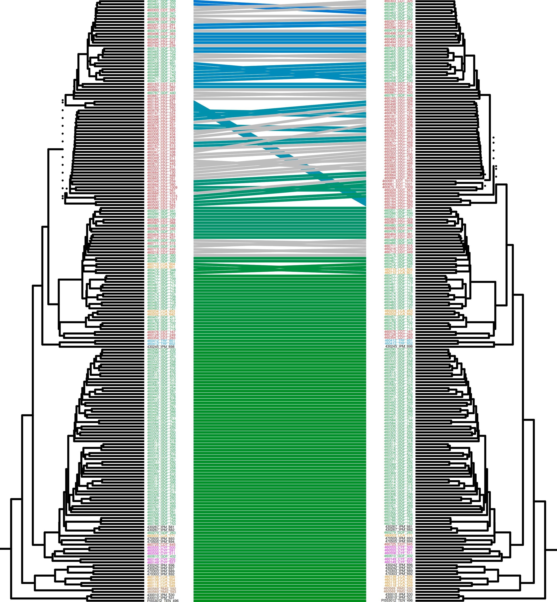

# Comparacion de matrices y dendrogramas

Resumen de la metodologia para la comparacion de matrices de distancias y sus respectivos dendrogramas.
&nbsp;  
&nbsp;  
```
install.packages("ape")
install.packages("tidyverse")
install.packages("phytools")
install.packages("dendextend")
```
&nbsp;  
&nbsp;  
#### 1. Se estandarizan las matrices de distancia para que todas presenten el mismo orden de muestras.

&nbsp;  
&nbsp;  
#### 2. Se genera una nueva matriz al restar ambas matrices originales

&nbsp;  
&nbsp;  
#### 3. Se revisan los valores en la nueva matriz, se elige los rangos maximos, minimos e intermedios y se les asignan colores.

&nbsp;  
&nbsp;  
#### 4. Al tener el orden de muestras segun el árbol se puede incluir este último en los bordes del gráfico.


&nbsp;  
&nbsp;  
#### 5. Tanglegram, comparación directa de árboles previamente enraizados

